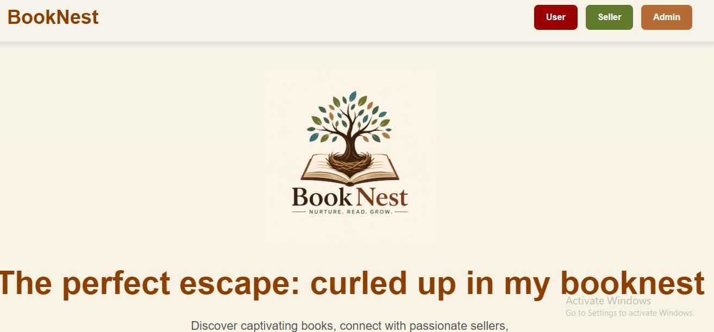
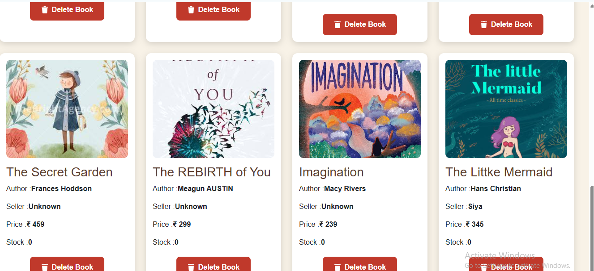
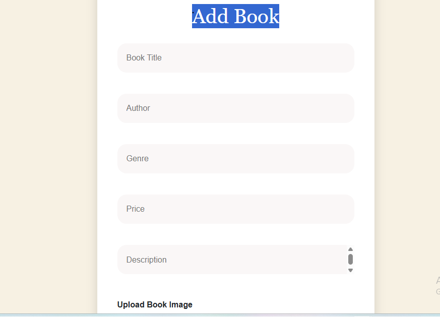
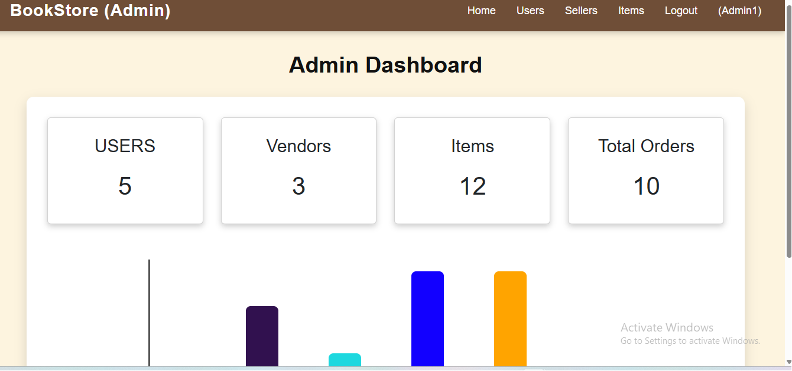
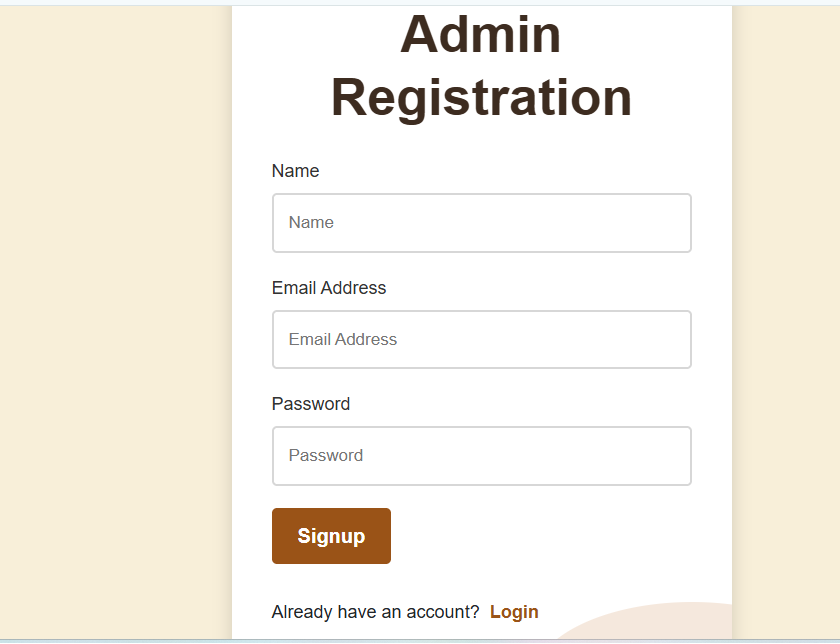
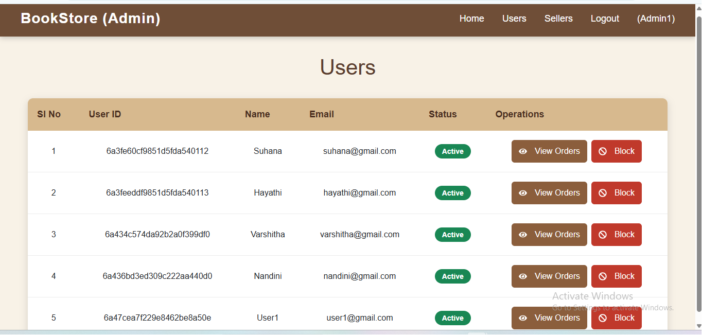

# 📚 BookNest – Online Book Store (MERN Stack)

BookNest is a full-stack MERN-based online bookstore where users can browse books, add books to wishlist, place orders, and track purchases. Sellers can manage book inventory, while admins can monitor users, sellers, and platform activities.

---

## 🚀 Features

### 👤 User Module
- User Registration & Login
- Browse Books
- View Book Details
- Add to Wishlist
- Place Orders
- View Order History
- Track Order Status

### 🛒 Seller Module
- Seller Registration & Login
- Add New Books
- Manage Inventory
- View Orders

### 🛠️ Admin Module
- Admin Login
- Manage Users
- Manage Sellers
- View All Books
- Monitor Orders

---

## 💻 Tech Stack

### Frontend
- React.js
- React Router DOM
- Axios
- CSS

### Backend
- Node.js
- Express.js

### Database
- MongoDB
- Mongoose

---

## 📂 Project Structure

```text
BookNest
│
├── client
│   ├── public
│   ├── src
│   ├── package.json
│   └── vite.config.js
│
├── server
│   ├── config
│   ├── controllers
│   ├── middlewares
│   ├── models
│   ├── routes
│   ├── uploads
│   ├── package.json
│   └── server.js
│
├── screenshots
├── README.md
└── .gitignore
```

---

## ⚙️ Installation

### Clone Repository

```bash
git clone https://github.com/kammuruSuhana/BookNest.git
```

### Frontend Setup

```bash
cd client
npm install
npm run dev
```

### Backend Setup

```bash
cd server
npm install
npm start
```

---

## 📸 Screenshots

### 🏠 Home Page


### 📚 Book Inventory


### ➕ Add Book Page


### 👨‍💼 Admin Dashboard


### 🔐 Admin Registration


### 👥 Users Management


---

## 🎯 Future Enhancements

- Online Payment Gateway
- Email Notifications
- Book Reviews & Ratings
- Advanced Search & Filters
- Seller Analytics Dashboard

---

## 👩‍💻 Author

**Kammuru Suhana**

B.Tech (CSE)  
Anantha Lakshmi Institute of Technology and Sciences (ALITS)

GitHub: https://github.com/kammuruSuhana

---

## 📜 License

This project is developed for educational and learning purposes.
